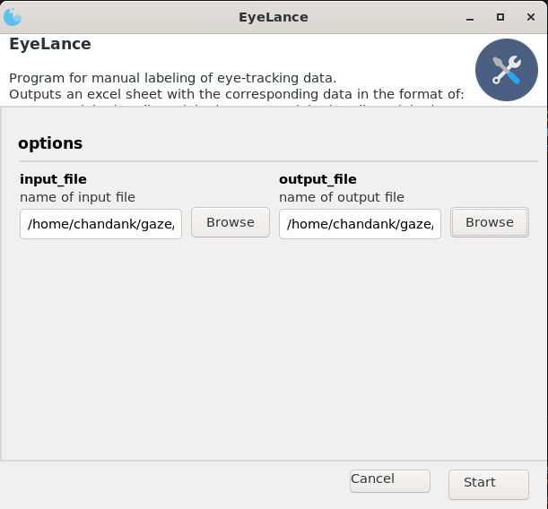
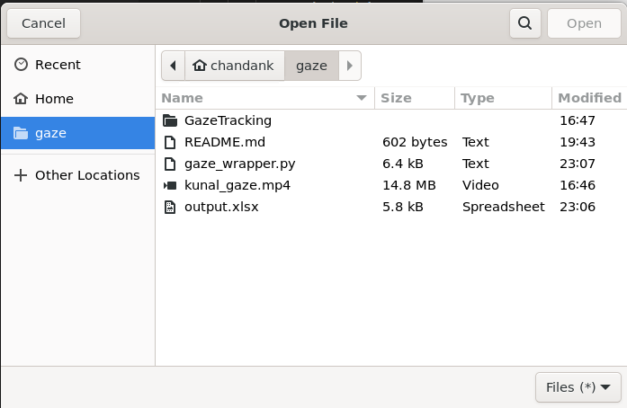
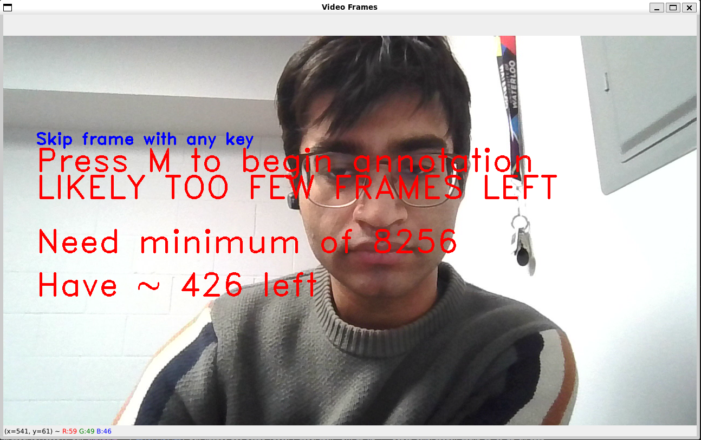
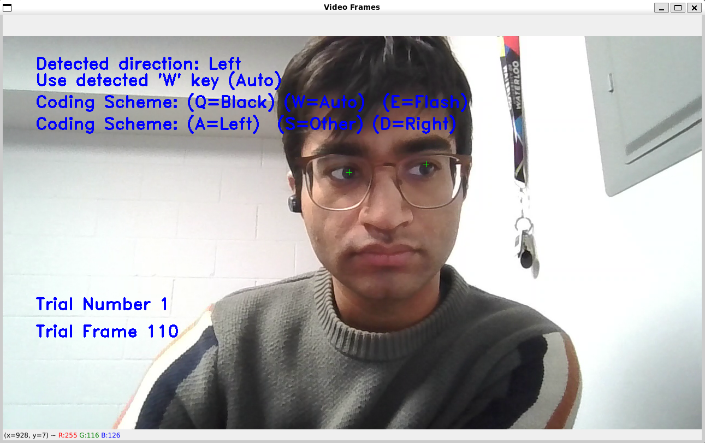
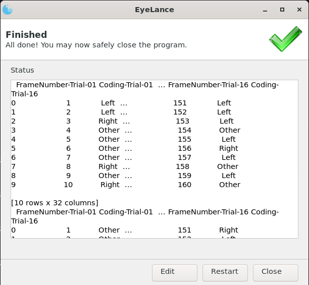
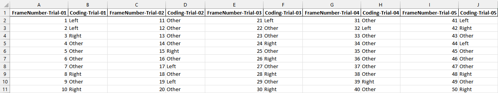

# EyeLance: Gaze Writing Program
Works best in a linux environment. On windows just use WSL unless you hate yourself.

Setup:

```
sudo apt update
sudo apt upgrade

sudo apt install git cmake
sudo apt install ffmpeg libsm6 libxext6
sudo apt install python3 
sudo apt install python3-pip
pip3 install attrdict3 Gooey
pip3 install numpy pandas openpyxl opencv_python dlib

git clone https://github.com/kunalchandan/EyeLance.git
cd EyeLance
git clone https://github.com/antoinelame/GazeTracking.git


```

## Usage

Launch the program with:
```
python3 gaze_wrapper.py
```
This will take in a path to the video file you want to label and will output an excel sheet with the appropriate labeled codings.


Old usage syntax CLI only. DEPRECATED.
```
python3 gaze_wrapper.py --input-video input_video.mp4 --output-sheet output-sheet.xlsx
```

### Launcher


### Selecting a file


### Begining marking video
This example has too few frames to fill the entire dataset so a warning is shown.



### Coding 


### Completion Screen
Can restart coding screen

Can also edit selection and code another video and output another excel sheet or overwrite the same one.


### Resulting output



## Issues/Feature Requests
Open an Issue on github and I'll have a look one day.


## License 
Released under the GPLv2 License


## Citation
You don't have to, but it'd be real nice 😉.


Bibtex format:

```bibtex
 @misc{kchandan_2023_eyelance,
   title     = {EyeLance: Computer assisted gaze-tracking software},
   author    = {Kunal Chandan},
   month     = mar,
   year      = {2023},
   version   = {1.0},
   url       = {https://github.com/kunalchandan/EyeLance},
 }
```
